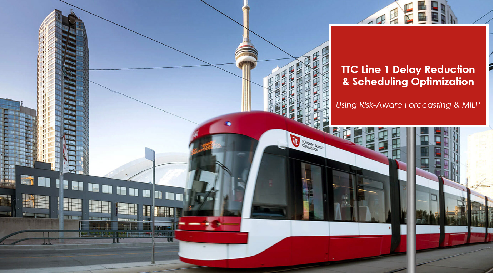

)

# TTC Line 1 — Delay Reduction & Scheduling Optimization

 
**Year:** 2025  

---

## Project Overview
Toronto’s Line 1 (Yonge–University) subway is the busiest corridor in the TTC network, serving hundreds of thousands of riders daily. However, frequent delays — especially passenger-related incidents such as platform overcrowding, misuse of alarms, and unauthorized track entry — reduce reliability and increase operational costs.

This project develops a risk-aware, data-driven scheduling framework that combines:

- Historical Delay Data Analysis (City of Toronto Open Data)  
- Time-Series Risk Forecasting using Facebook Prophet  
- Mixed-Integer Linear Programming (MILP) optimization using PuLP in Python  

Our strategy, called Modified Option 2, dynamically adjusts train frequency in response to forecasted delay risk. Results show:  
- Average delay reduced to 3.14 minutes during peak hours  
- Operational savings of approximately $6,600 per day  
- Balanced trade-off between cost control and service quality  

---

## Objectives
- Delay Attribution: Identify and classify major passenger-related delay types.  
- Risk Forecasting: Predict hourly disruption risk using Prophet.  
- Schedule Optimization: Use MILP to dynamically adjust train frequencies.  
- Cost Control: Minimize operations cost while maintaining service standards.  
- Scalability: Provide a framework adaptable for future TTC expansion.  

---

## Repository Structure
TTC-Line1-Optimization/
│
├── report/
│ ├── final_report.pdf # Formal written report
│ └── code_dump.pdf # Extracted Colab/code PDF
│
├── notebooks/
│ └── Final_Analysis_TTC_line_1 (1).ipynb # Main analysis notebook
│
├── src/
│ ├── forecasting.py # Risk forecasting with Prophet
│ ├── optimization.py # PuLP MILP optimization model
│ └── utils.py # Helper functions
│
├── data/
│ └── README.md # Instructions for downloading TTC dataset
│
├── results/ # Forecast & optimization outputs
│
├── requirements.txt # Dependencies
├── LICENSE # MIT License
└── README.md # This file

---

## Getting Started

### Option 1: Run the Notebook in Google Colab (Recommended)
You do not need to install anything. Click the badge below to open the notebook in Google Colab:

Steps:
1. Open the notebook using the badge above.  
2. Download the TTC delay dataset from [Toronto Open Data](https://open.toronto.ca/dataset/ttc-subway-delay-data/).  
3. In Colab, upload the CSV into the `/data/` folder (use the folder icon → Upload).  
4. Run all cells: Runtime → Run all.  
5. View results inside the notebook (graphs, optimized schedules).  

### Option 2: Run Locally (for developers)
1. Clone the repository.  
2. Install dependencies from `requirements.txt`.  
3. Place TTC delay dataset in `data/`.  
4. Run the Python scripts (`src/forecasting.py`, `src/optimization.py`).  

---

## Key Results

| Strategy              | Avg Delay (min) | Daily Savings |
|-----------------------|-----------------|---------------|
| Option 1 – Min Freq   | 4.20            | $47.7k        |
| Modified Option 2     | 3.14            | $6.6k         |
| Option 3 – Max-Min    | 3.00            | $0            |

Modified Option 2 provides the best balance of cost savings and service reliability.  

---

## Future Work
- Deploy models in real-time with IoT sensors.  
- Expand to other TTC subway lines.  
- Test passenger behavior interventions (awareness campaigns, staffing).  

---

## Citation
If you use this repository, please cite:

Demoz, D.S.*TTC Line 1 Delay Reduction and Scheduling Optimization Using Risk-Aware Forecasting and MILP.* University of Ottawa.

---

## License
This project is licensed under the MIT License – see the LICENSE file for details.  

